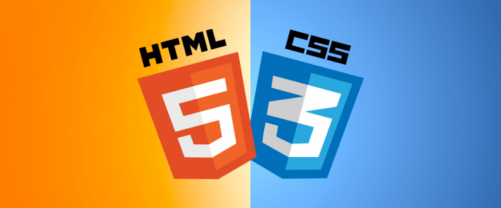

<h1>Alura+</h1>

 	 

o layout de um website que promove os cursos da Alura.
o site é demonstrativo, penas a parte visual está presente aqui, fazendo parte dos estudos no curso de HTML e CSS.

<h3>✔️ Tecnologias utilizadas:</h3>

``CSS``
``HTML``
